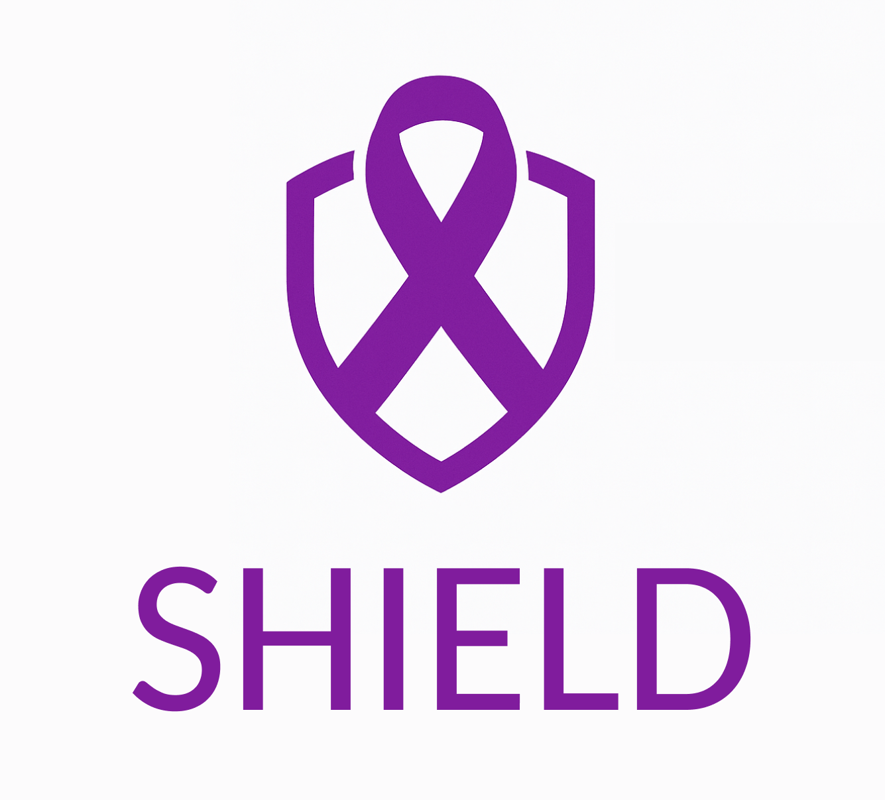

# SHIELD

## Project Information

Project SHIELD uses innovative multiplex immunoassays and AI for comprehensive early detection and monitoring of high-risk individuals with pancreatic cancer, ensuring strong ethics, privacy, and regulatory compliance through expert oversight.

SHIELD is developing a simple, affordable blood test to detect pancreatic cancer at its earliest, most treatable stage. By identifying and testing people with elevated genetic risk, SHIELD aims to reduce late-stage diagnoses and increase Europe’s five-year survival rate from under 10% today to 30% by 2035.

## CI/CD Services

* [Jenkins](https://jenkins.shield.rid-intrasoft.eu)
* [Harbor](https://harbor.shield.rid-intrasoft.eu)
* [Keycloak](https://keycloak.shield.rid-intrasoft.eu)

## Social Media and Website

* [Website](https://missionshield.eu/)
* [Email](info@missionshield.eu)
* [Youtube](https://www.youtube.com/@missionSHIELD)
* [X](https://x.com/MissionSHIELDeu)
* [LinkedIn](https://www.linkedin.com/company/missionshield-eu/)
